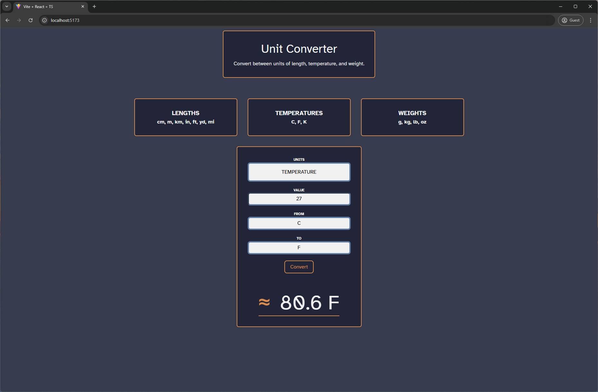

# UnitConverterAPI

This is a unit convertion app. You can convert length, weight or temperature units, for example, you could convert `2500` centimeters (`cm`) to meters (`m`) to obtain `25 m`.

## Screenshot



## Features

- **Real-Time Unit Conversion**: Choose a unit type (length, temperature, or weight), specify the source and target units, and input a value to see the converted result.
- **Local Storage Caching**: Unit lists are cached in local storage, reducing API calls.
- **Error Handling and Testing**: xUnit for backend validation.

## Setup

### Requirements

- [.NET SDK](https://dotnet.microsoft.com/en-us/download) to run the API.
- [NodeJS](https://nodejs.org/en) to run the client app.

### Install dependencies

- The API project installs and build the project automatically when starting it.
- Install dependencies in the React app `UnitConverterApp` running `npm i` in the command line.

### Run locally

- API
  - Inside `UnitConverterAPI/UnitConverterAPI` folder enter `dotnet run` in the command line.
- React App
  - Inside `UnitConverterApp` folder enter `npm run dev` in the command line.
- Run API Tests located in `UnitConverterAPI/UnitConverterAPI.Tests` running `dotnet test` in the command line.

##

### API endpoints

- `/units` - Get Available Units

  - Method: `GET`
  - Description: Returns lists of units available for each type of measurement (length, weight and temperature).
  - Response:

  ```json
  {
    "length": ["m", "km", "cm", "mm", "in", "ft", "yd", "mi"],
    "weight": ["kg", "g", "t", "lb", "oz"],
    "temperature": ["c", "f", "k"]
  }
  ```

- `/convert` - Convert Units

  - Method: `POST`
  - Description: Converts a value from one unit to another within the same measurement type.
  - Request:

  ```json
  {
    "unitType": "length",
    "value": 100,
    "from": "m",
    "to": "km"
  }
  ```

  - Response:

  ```json
  {
    "unitType": "length",
    "from": "m",
    "to": "km",
    "previousValue": 100,
    "convertedValue": 0.1
  }
  ```

## Project Structure

### Services and Converters

- `UnitsService`: Provides lists of available units
- `UnitConvertionService`: Handles conversion based on unit type.
- `Converters`: Specific converters for `Length`, `Weight`, and `Temperature` handle unit conversions and errors for unsupported units.

## Unit Tests

Unit tests (`xunit`) are available for validating conversions in the following categories.

- Length Conversion Tests (`LengthConverterConvertLength`)

  - Tests for converting various length units like `mm` to `cm`, `cm` to `m`, `m` to `km`, `m` to `in`, `ft` to `yd`, and `yd` to `mi`.
  - Example:

  ```csharp
  [Fact]
  public void ConvertLength_250mToin_ReturnFalse()
  {
      var result = LengthConverter.ConvertLength(250, "m", "in");
      Assert.False(result != 9842.52m, "250 m to in should be 9842.52");
  }
  ```

- Temperature Conversion Tests (`TemperatureConverterConvertTemperature`)

  - Tests for converting temperature units like `C` to `F`, `F` to `C`, and `K` to `C`.
  - Example:

  ```csharp
  [Fact]
  public void ConvertTemperature25cTof()
  {
      var result = TemperatureConverter.ConvertTemperature(25, "c", "f");
      Assert.False(result != 77m, "25 c to f should be 77");
  }
  ```

- Weight Conversion Tests (`WeightConverterConvertWeight`)
  - Tests for converting weight units like `g` to `kg`, `kg` to `t`, and `lb` to `oz`
  - Example:
  ```csharp
  [Fact]
  public void ConvertWeight_250lbTooz_ReturnFalse()
  {
      var result = WeightConverter.ConvertWeight(250, "lb", "oz");
      Assert.False(result != 4000.07m, "250 lb to oz should be 4000.07");
  }
  ```
